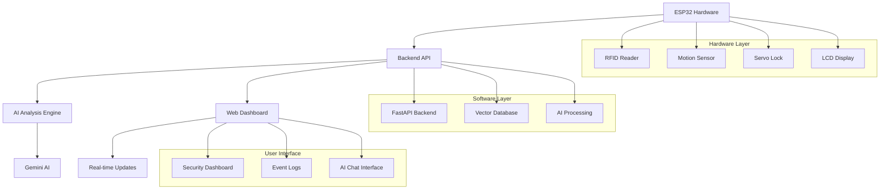

# 🔐 Vaultify - Smart Security System

<div align="center">


*An intelligent ESP32-based security system with AI-powered analysis, real-time dashboard, and comprehensive monitoring.*

</div>

---

## ✨ Features

<table>
<tr>
<td width="50%">

### 🎯 **Hardware Security**
- 🏷️ **RFID Access Control** - Contactless entry with authorized cards
- 🚨 **Motion Detection** - MPU6050 accelerometer for theft detection
- 🔒 **Auto-Lock** - Smart timing with 2-minute auto-lock
- 📱 **SMS Alerts** - Real-time notifications via Twilio

</td>
<td width="50%">

### 🤖 **AI-Powered Intelligence**
- 🧠 **Smart Analysis** - AI-powered security event analysis
- 📊 **Real-time Dashboard** - Live monitoring web interface
- 🔍 **Intelligent Insights** - Natural language security queries
- 📈 **Pattern Recognition** - Automated security trend analysis

</td>
</tr>
</table>

---

## 🏗️ System Architecture

<div align="center">



</div>

---

## 🚀 Quick Start

### 1️⃣ **Clone Repository**
```bash
git clone https://github.com/SH-Nihil-Mukkesh-25/Vaultify.git
cd Vaultify
```

### 2️⃣ **Backend Setup**
```bash
# Install Python dependencies
pip install fastapi uvicorn langchain langchain-google-genai python-dotenv requests

# Set up environment variables
echo "GEMINI_API_KEY=your_gemini_api_key_here" > .env

# Start the backend
python backend.py
```

### 3️⃣ **Frontend Access**
```bash
# Open the dashboard
start frontend.html
# Or navigate to: http://localhost:8000
```

### 4️⃣ **ESP32 Configuration**
```cpp
// Update hardware_code.ino with your credentials
const char* ssid = "Your_WiFi_Name";
const char* password = "Your_WiFi_Password";
const String BACKEND_URL = "http://YOUR_COMPUTER_IP:8000";
```

---

## 🛠️ Hardware Setup

### 📦 Required Components

| Component | Quantity | Purpose | 
|-----------|----------|---------|
| ESP32 DevKit | 1x | Main Controller | 
| MPU6050 | 1x | Motion Detection |
| MFRC522 RFID | 1x | Access Control |
| 16x2 I2C LCD | 1x | Status Display | 
| SG90 Servo | 1x | Lock Mechanism | 
| Buzzer | 1x | Audio Alerts | 
| RFID Cards | 2-5x | Access Keys | 

### 🔌 Pin Configuration

<div align="center">

| 🎛️ **Component** | 📍 **ESP32 Pin** | 🔗 **Connection** |
|:---------------:|:----------------:|:-----------------:|
| 🔊 Buzzer | `GPIO 25` | Digital Output |
| ⚙️ Servo Motor | `GPIO 26` | PWM Signal |
| 📺 LCD (SDA) | `GPIO 21` | I2C Data |
| 📺 LCD (SCL) | `GPIO 22` | I2C Clock |
| 🏷️ RFID (SS) | `GPIO 5` | SPI Select |
| 🏷️ RFID (RST) | `GPIO 4` | Reset |
| 📊 MPU6050 | `I2C Bus` | Motion Sensor |

</div>

---

## 💻 Software Installation

### 🐍 **Backend Dependencies**

```bash
# Core framework
pip install fastapi uvicorn

# AI and ML libraries
pip install langchain langchain-google-genai langchain-community

# Utilities
pip install python-dotenv requests

# Optional: For development
pip install python-multipart
```

### 📚 **Required Arduino Libraries**

| Library | Version | Installation |
|---------|---------|-------------|
| `LiquidCrystal_I2C` | Latest | Library Manager |
| `MPU6050_light` | Latest | Library Manager |
| `MFRC522` | Latest | Library Manager |
| `ESP32Servo` | Latest | Library Manager |

**Quick Install:**
```cpp
// In Arduino IDE: Tools → Manage Libraries → Search & Install:
LiquidCrystal I2C by Frank de Brabander
MPU6050 light by rfetick  
MFRC522 by GithubCommunity
ESP32Servo by Kevin Harrington
```

---

## 🤖 AI Features

### 🧠 **Intelligent Analysis**

The system uses Google's Gemini AI to provide:

- **🔍 Security Insights**: "What security events have occurred today?"
- **📊 Pattern Analysis**: "How many unauthorized access attempts were there?"
- **🚨 Threat Assessment**: "Are there any suspicious patterns in the logs?"
- **📈 Trend Analysis**: "Show me the security summary for this week"

### 🎯 **Natural Language Queries**

Ask questions in plain English:

```
"Who tried to access the door today?"
"How many times was the door unlocked?"
"Show me all motion alerts"
"What's the security status?"
```

### 📊 **Real-time Dashboard**

- **Live Event Stream**: Real-time security event monitoring
- **AI Summary**: Automated security insights
- **Interactive Chat**: Ask questions about your security data
- **Visual Analytics**: Door status and event patterns

---

## 🔧 Configuration

### 🔑 **API Keys Setup**

1. **Gemini AI Key**:
   ```bash
   # Get free API key from: https://makersuite.google.com/app/apikey
   echo "GEMINI_API_KEY=your_actual_api_key" > .env
   ```

2. **Twilio SMS** (Optional):
   ```cpp
   const String TWILIO_ACCOUNT_SID = "ACxxxxxxxxxxxxxxxxxxxxxxxxxxxxxxxx";
   const String TWILIO_AUTH_TOKEN = "your_32_character_auth_token";
   const String DEST_PHONE = "+1234567890";
   ```

### 🌐 **Network Configuration**

```cpp
// ESP32 WiFi Setup
const char* ssid = "Your_WiFi_Name";
const char* password = "Your_WiFi_Password";

// Backend URL (replace with your computer's IP)
const String BACKEND_URL = "http://192.168.1.100:8000";
```

---

## 📊 API Endpoints

### 🔌 **Backend API Reference**

| Endpoint | Method | Description |
|----------|--------|-------------|
| `/api/health` | GET | System health check |
| `/api/logs` | GET | Retrieve all security logs |
| `/api/logs` | POST | Add new security event |
| `/api/summary` | GET | Get AI-generated summary |
| `/api/ask` | GET | Ask AI questions about security |

### 📝 **Example API Usage**

```python
# Add a security event
import requests
event = {
    "event": "door_unlocked",
    "detail": "RFID authorized"
}
response = requests.post("http://localhost:8000/api/logs", json=event)

# Ask AI a question
response = requests.get("http://localhost:8000/api/ask?question=What security events occurred today?")
print(response.json()["answer"])
```

---

## 🚨 Security Modes

<div align="center">

#### 🏃‍♂️ Motion Detection Flow

<table>
<tr>
<td width="16%" align="center">
<strong>🔍 Motion<br>Detected</strong>
</td>
<td width="4%" align="center">→</td>
<td width="16%" align="center">
<strong>🚨 Alarm<br>Activated</strong>
</td>
<td width="4%" align="center">→</td>
<td width="16%" align="center">
<strong>🔒 Door<br>Locks</strong>
</td>
<td width="4%" align="center">→</td>
<td width="16%" align="center">
<strong>📱 SMS<br>Alert</strong>
</td>
<td width="4%" align="center">→</td>
<td width="20%" align="center">
<strong>🤖 AI<br>Analysis</strong><br>
<em>(Logs to backend)</em>
</td>
</tr>
</table>

</div>

### 🛡️ Security Status Overview

| 🟢 **Normal Mode** | 🟡 **Alert Mode** | 🔴 **Lockdown Mode** |
|:------------------:|:------------------:|:--------------------:|
| System monitoring | Invalid access detected | Theft attempt detected |
| RFID access enabled | Audio/visual warnings | All access disabled |
| Auto-lock timer active | SMS notifications sent | Continuous alarm |
| AI analysis active | Backend logging | Emergency lockdown |

---

## 🎛️ Customization

### ⚙️ **Adjustable Parameters**

```cpp
// Servo Positions
#define SERVO_LOCKED_POS 70      // Adjust for your lock mechanism
#define SERVO_UNLOCKED_POS 160   // Fine-tune door opening angle

// Security Settings  
#define ACCEL_THRESHOLD 0.6      // Motion sensitivity
const unsigned long ALARM_DURATION = 120000;    // 2 minutes alarm
const unsigned long DOOR_AUTO_CLOSE = 120000;   // 2 minutes auto-lock
```

### 🏷️ **Adding RFID Cards**

1. **Scan Unknown Card** (check Serial Monitor):
   ```
   New card detected: A1 B2 C3 D4
   ```

2. **Add to Valid Cards Array**:
   ```cpp
   byte validCards[][4] = {
     {0x3D, 0xF3, 0x3B, 0x06},  // Existing card
     {0xA1, 0xB2, 0xC3, 0xD4},  // New card ✨
   };
   ```

---

## 🔧 Troubleshooting

### 🤖 **AI Backend Issues**
<details>
<summary>Click to expand solutions</summary>

**Common Issues:**
- ✅ Check Gemini API key in `.env` file
- ✅ Verify internet connection for AI requests
- ✅ Ensure backend is running on port 8000
- ✅ Check API quota limits

**Debug Commands:**
```bash
# Test API key
python -c "from dotenv import load_dotenv; import os; load_dotenv(); print('API Key loaded:', bool(os.getenv('GEMINI_API_KEY')))"

# Test backend health
curl http://localhost:8000/api/health
```
</details>

### 🌐 **WiFi & Network Issues**
<details>
<summary>Click to expand solutions</summary>

**ESP32 Connection:**
```cpp
// Debug WiFi connection
Serial.println("WiFi Status: " + String(WiFi.status()));
Serial.println("SSID: " + String(WiFi.SSID()));
Serial.println("IP Address: " + WiFi.localIP().toString());
```

**Backend Connection:**
```cpp
// Test backend connectivity
HTTPClient http;
http.begin(BACKEND_URL + "/api/health");
int httpCode = http.GET();
Serial.println("Backend Status: " + String(httpCode));
```
</details>

### 🏷️ **RFID Problems**
<details>
<summary>Click to expand solutions</summary>

**Connection Test:**
```cpp
void setup() {
  if (!rfid.PCD_Init()) {
    Serial.println("❌ RFID initialization failed!");
  } else {
    Serial.println("✅ RFID ready");
  }
}
```

**Common Issues:**
- ✅ Check SPI connections (MISO, MOSI, SCK)
- ✅ Verify 3.3V power supply
- ✅ Try different RFID cards
- ✅ Clean card and reader surface
</details>

---

## 📱 Usage Examples

### 🎯 **Testing the System**

1. **Start Backend**:
   ```bash
   python backend.py
   ```

2. **Open Dashboard**:
   ```bash
   start frontend.html
   ```

3. **Test AI Features**:
   - Ask: "What security events have occurred?"
   - Ask: "How many door unlocks today?"
   - Ask: "Show me motion alerts"

4. **Simulate Events**:
   ```bash
   python simulate_logs.py
   ```

### 🔍 **AI Query Examples**

```
"Who are you?"
"What security events have occurred today?"
"How many times has the door been unlocked?"
"Are there any suspicious patterns?"
"Show me a summary of recent activity"
"What motion alerts have been triggered?"
```

---

## 🚀 Advanced Features

### 📊 **Data Analytics**

The system automatically:
- **Logs all security events** with timestamps
- **Creates vector embeddings** for intelligent search
- **Provides pattern analysis** through AI
- **Generates security insights** and recommendations

### 🔄 **Real-time Updates**

- **Live dashboard** updates every 5 seconds
- **Instant AI responses** to security queries
- **Automatic event logging** from ESP32
- **Real-time status monitoring**

---

## 🤝 Contributors

| Contributor | Role |
|-------------|------|
| [SH Nihil Mukkesh](https://github.com/SH-Nihil-Mukkesh-25) | Hardware , AI Integration & Deployment |
| [Dakshin Raj P](https://github.com/Dakshin10) | Hardware , Firmware & Testing |
| [Pravin Aditya] | Circuit Connections & Simulation |
| [Sharvesh C] | Circuit Connections & Simulation |

---

## 📜 License

<div align="center">

**MIT License** - See [LICENSE](LICENSE) file for details

*This project is open-source and free to use for educational and personal purposes.*

</div>

---

<div align="center">

### ⭐ **Star this repo if it helped you!**

**Made with ❤️ for the security and AI community**

*Secure your space with intelligent monitoring* 🔐🤖

---

</div>
